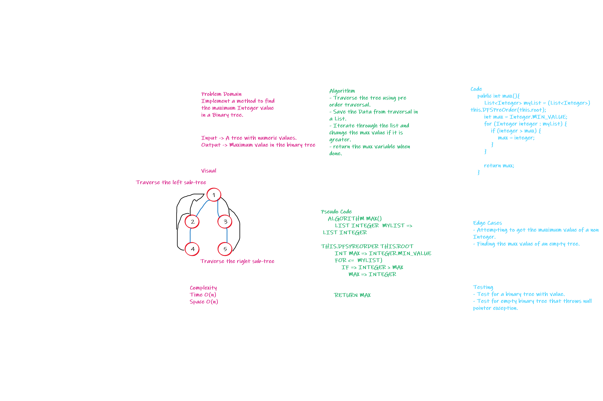

# Trees
Tree is a non-linear data structure that uses connected nodes to represen hierarch data
and have a root node that have 0 or more children up to 2 children and that applies to every child node.

## Challenge
Challenge to implement Binary tree and Binary Search tree.

## Approach & Efficiency
Used recursion to traverse through the tree with time complexity of n,
Used Iterative approach to add to binary search tree with O(n),
Used Iterative to check if element exists with O(n).

## API
#### Class Node
Class Holds data and right and left children of elements.
#### Class BinaryTree
- Method DFSInOrder (Takes the root) : Recursion O(n) traverses using the InOrder method.
- Method DFSPreOrder (Takes the root) : Recursion O(n) traverses using the PreOrder method.
- Method DFSPostOrder (Takes the root) : Recursion O(n) traverses using the PostOrder method.
- Method max() : Returns an Integer, implements on of the traversal that returns a list and supplies the maximum value,
with O(n) for both space and time.

#### Class BinarySearchTree
- Method add(G data) : Iterativly adds an element to the right position O(n).
- Method contains(G key) : Iterativly searches an element exists to the right position O(n).

# Challenge 16 : To find the maximum value in the tree 

## Whiteboard Process

## Approach & Efficiency
Implemented a max method that returns an integer, Saved the traversed data into a list and loop through the list and find 
the maximum value and return it.

Space O(n)
Time O(n)

## Solution
- Make an object of the Binary Tree and add elements to it.
- Call the max method to find the maximum value in the tree.

# Challenge 17 : Apply Breadth first search to a tree

## Whiteboard Process

## Approach & Efficiency
Used a queue to travers the tree and add the root node to traverse and dequeue when done and add the latest one.

Space O(2*n)
Time O(n)

## Solution
- Make an object of the Binary Tree and add elements to it.
- Call the breadth method to get a list of elements in BFS order.