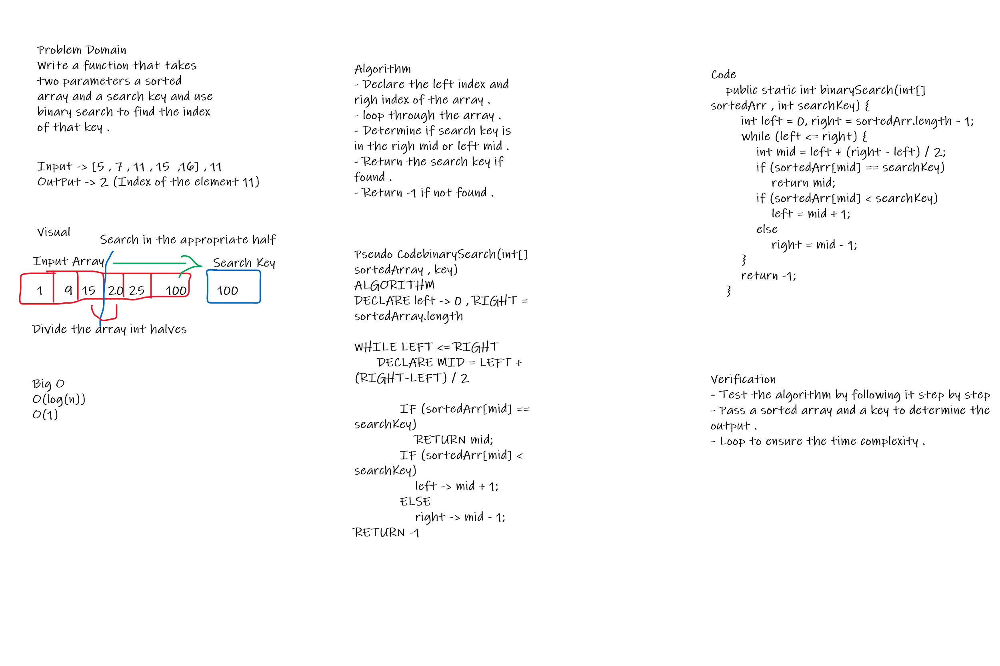

# Binary Search of Sorted Array
A method with a sorted array and a key to search for that key and returns the index if found and 
-1 if not found .

## Whiteboard Process

## Approach & Efficiency
Used binary search algorithm to find the element 
took Big O(log(n))