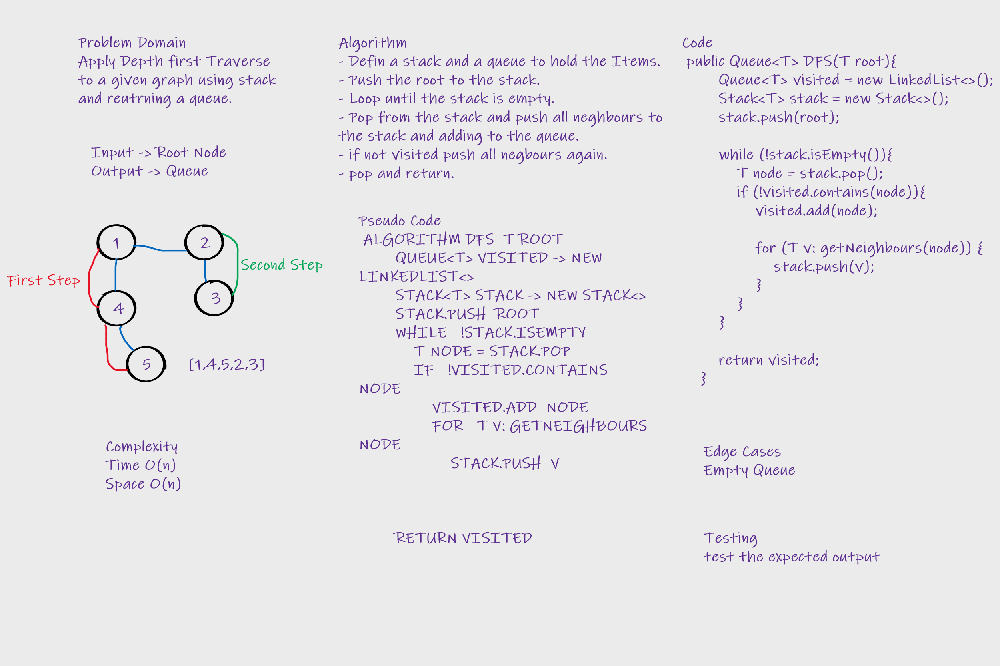

# Graphs
A Graph is a non-linear data structure consisting of nodes and edges. 
The nodes are sometimes also referred to as vertices and the edges are lines or arcs that connect any two nodes in the graph.

## Challenge
Implementing Graph Data structure.

## Approach & Efficiency
Implemented the graph and held the nodes of it into a hash map with type T (Generic), and Another Hash map 
of type T, Integer(For the weight). 
## API
Class Graph :
- Member Variables:
    - Hash map nodes<T , <HashMap<T , Integer>>>
- Methods : 
  - addNode(T node) : adds a node to the graph (no edges specified yet).
  - addEdge(T sourceNode , T destinationNode , int weight) : adds an edge between two nodes.
  - getNodes() : returns All nodes in a graph.
  - getNeighbours(T node) : returns all neighbours of a specific graph.
  - getSize() : returns the size of the graph.

# Challenge 36
To apply Breadth first traversal to a graph.

## Whiteboard Process

## Approach & Efficiency
Used two Queue-Linked lists To traverse each Neighbour in the node.

## Solution
To try the method and find out that it's working, create a graph object
Then add some nodes and connect them with edges and then call the method on the graph object.

# Challenge 37
Check if given nodes can be traversed(connected) or not and return boolean and total weight.

## Whiteboard Process

## Approach & Efficiency
Traversed the given array and check each index is a neighbour of the next index.

## Solution
Add edges between specific nodes and call the method and after that print the result.

# Challenge 38
Apply Depth First traverse to a given graph and return a Queue with the visited nodes.

## Whiteboard Process

## Approach & Efficiency
Used A queue to hold the visited elements once and a stack to travers the 
given nodes keep traversing the next depth node and push to the stack then keep popping until a non visited node
occurs and repeat.

## Solution
Make a graph and call the method upon it and print the result out.