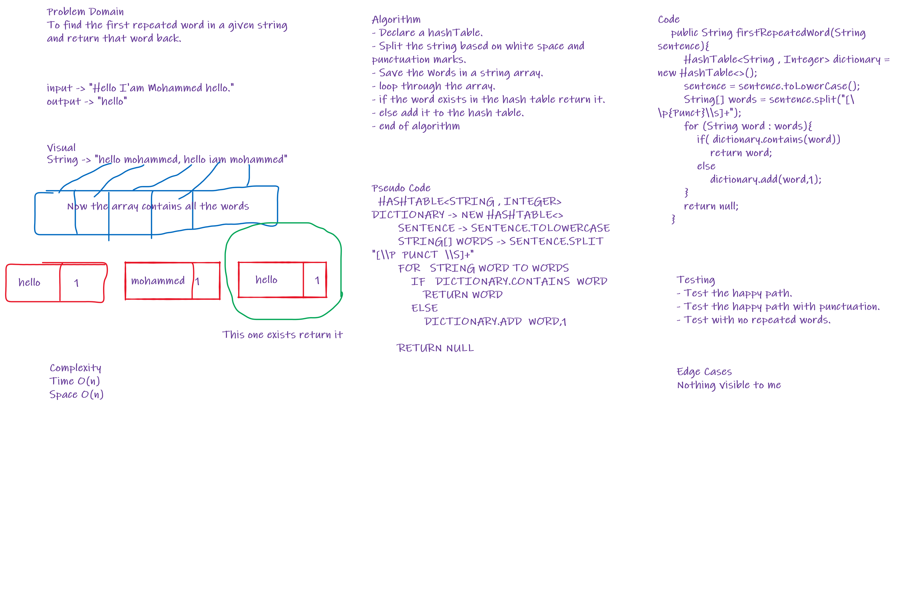
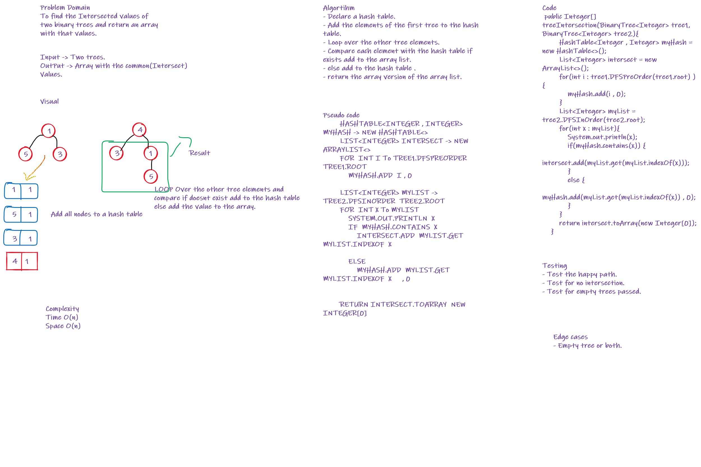

# Hashtables
a hash table (hash map) is a data structure that implements an associative array abstract data type, a structure that can map keys to values

## Challenge
Implementing Hash table using two classes.

## Approach & Efficiency
Implemented a HashNode Class that will hold the data and the reference to the next node.
Implemented the HashTable class that will map the values into an arrayList of nodes.

## API
- Class HashNode :
  - Key and value of generic Types.
- Class HashTable :
  - add(K key , V value) : Adds a value to the hash table with the given key, value pair.
  - get(K key) : Retrieves the value of the given key, and null for non-existence.
  - contains(K key) : Checks if value is existing in the hash table.
  - hashCode() : Returns the hashCode of the table.

# Challenge 31
To find the first repeated word in a String and return it.

## Whiteboard Process

## Approach & Efficiency
Divided The String into an array of Strings and added each element into the hash table and return the first duplicate word.

## Solution
Simply Create a string and pass it to the method and print the result back.

# Challenge 32
To find the Intersected values of two binary trees and return an array with that values.

## Whiteboard Process

## Approach & Efficiency
Created an array list to hold the values and added the first tree to
the hash Table and looped over the second tree values and if exists push that value
to the array list and else add it to the hash table.
O(n)
O(n)

## Solution
Declare two trees with values and make an object of the main class
then call the method over those two arrays and save the value in an array.