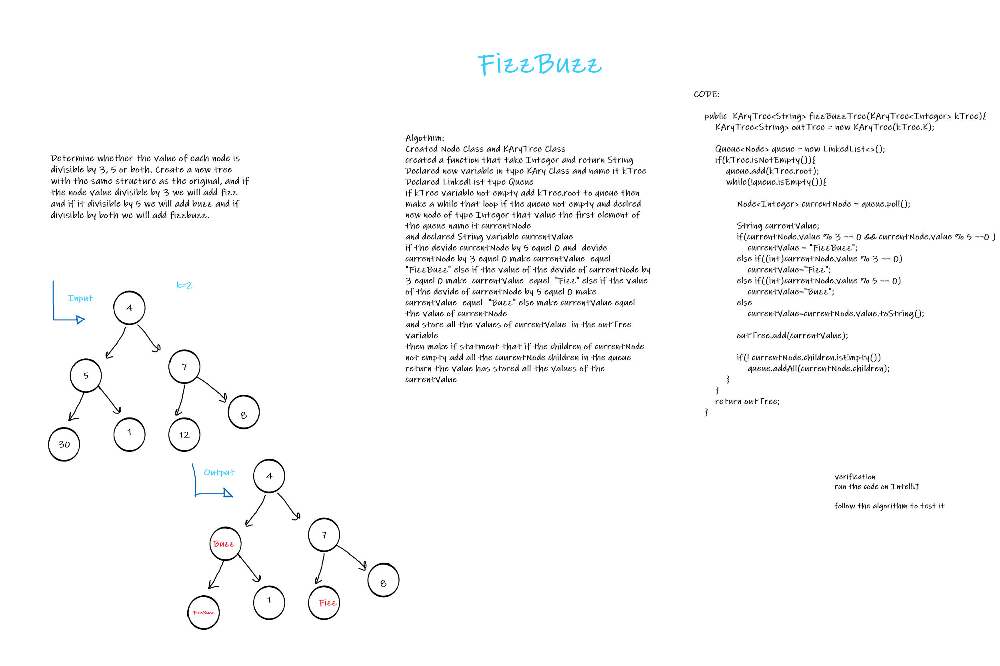

# KAryTree
Tree is a non-linear data structure that uses connected nodes to represen hierarch data
and have a root node that have 0 or more children up to K children and that applies to every child node.

## Challenge
Challenge to implement KArry Tree and fizzbuzz method
to replace values that are divisible by 3, 5 and 15 to a specific value.

## Approach & Efficiency
Implemented the Node class that Have a list of children
Implemented the kary tree class that have the add and to string methods.
Defined the Method and the algorithm to solve the challenge.

## API
#### Class Node
Class Holds data and List of children elements(Nodes).

#### Class KAryTree
Method to add to the K-ary tree.
Method to display the data.
Method FizzBuzz Replaces the data if divisible by 3 with fizz
divisible by 5 with buzz and divisible by both with fizzbuzz
and convert it to string if none of that applied O(n) for time.

