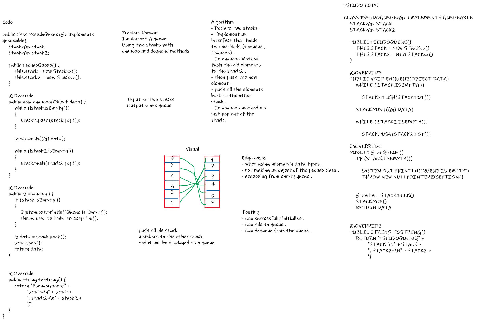
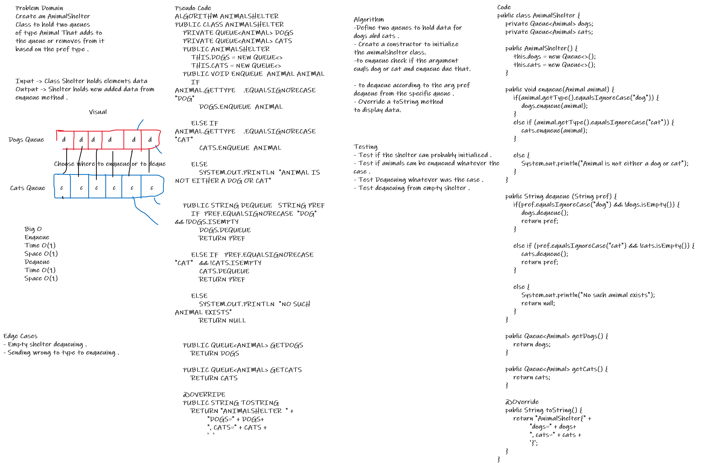
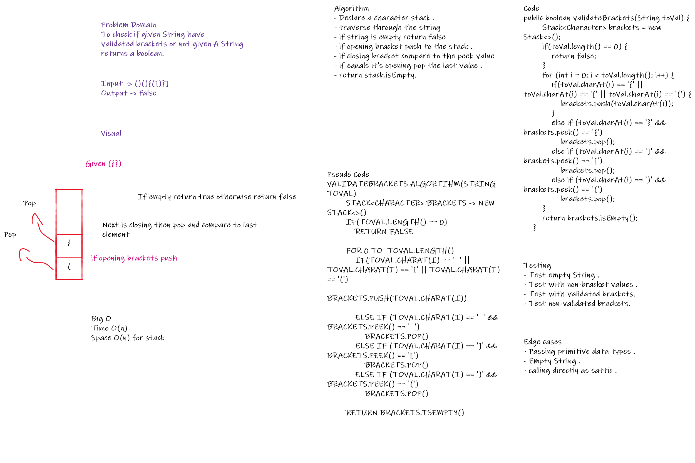

# Stacks and Queues
A program to implement Stack and queue data structures using linked list methodolgy .

## Challenge
To implement stack and queue using linked list .

## Approach & Efficiency
Used the Node class which holds the data and a reference variable of type node to implement Stacks and queues with Time complexity of O(1) for methods and O(n) in the toString method .
## API
### Class Stack : 
#### Member variables : 
- Node top : reference variable to hold the top index element .
- int idx : Integer to hold the latest index of stack initialized with -1 in the constructor .

#### Methods :
- push(T data) : Adds a new element to the stac with void return value . O(1)
- pop() : removes the top element of the stack with Node return type . O(1)
- peek() : Returns the top element of the stack with Node return value . O(1)
- isEmpty() : Returns boolean if the stack was empty or not regarding it's idx . O(1)
- toString() **Overriden** : Displays the data held in the stack with String return value . O(n)

### Queue Class : 
#### Member variables :
- Node front : reference variabl holds the front element which will be dequeued from .
- Node rear : reference variabl holds the rear element which will be enqueued to .
- int idx : Integer variable to hold the latest index in the queue .

#### Mthods : 
- enqueue (G data): Adds an element to the rear of the queue with void return type .O(1) 
- dequeue (): Removes element from the front of the queue with Node return type . O(1)
- peek (): Returns the front item which is the oldest item entered Node return type . O(1)
- isEmpty (): Returns boolean if the queue was empty or not . O(1)
- toString() **Overriden** : Displays the data held in the queue with String return value . O(n)

### PseudoQueue Class :
#### Member Variables :
- Stack<G> stack : holds the queue elements .
- Stack<G> stack2 : holds the temporary elements when enqueing .

#### Methods :

- enqueue (G data) : Adds an element to the queue using two stacks .
- dequeue () : Removes the oldest element .

### Animal Class
#### Member variables 
- String type : holds the type of the animal .

### AnimalShelter Class 
- Queue<Animal> dogs : queue to hold animals from type dogs .

- Queue<Animal> cats : queue to hold animals from type cats .

#### Methods :

- enqueue(Animal animal) : Adds an element to the queue of cats or dogs .

- dequeue (String pref) : Removes element based on the pref variable .

# Challenge Validate brackets 

- Method to validate if a given String is balanced and returns boolean as a return value .

## Whiteboard Process

## Approach & Efficiency
- Used a stack to validate using the push and pop methods,
With O(n) for both time and space.

## Solution
- Clone the repo .
- Navigate to the challenges/stack-queue Directory .
- Rub it using the IDE or the terminal using ./gradlew run.
- Provided Running Code in the main method . 